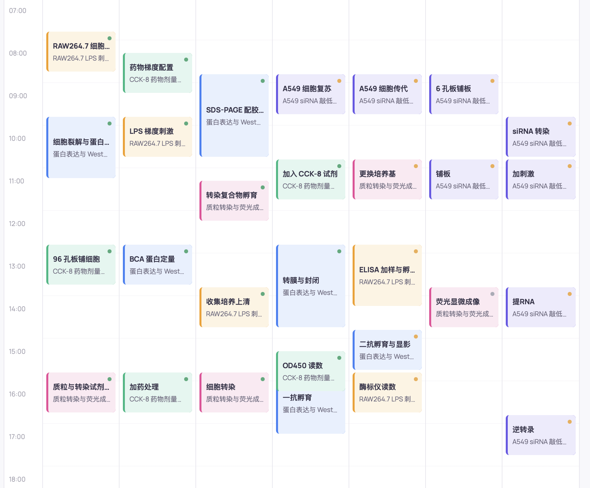
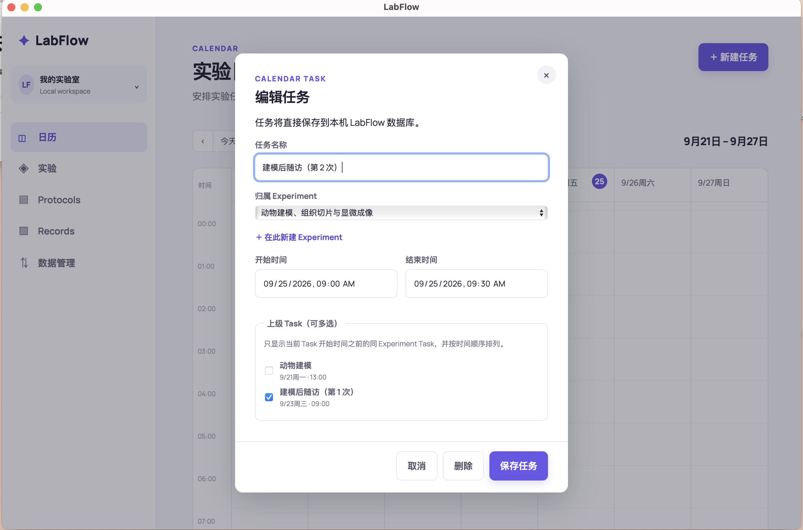
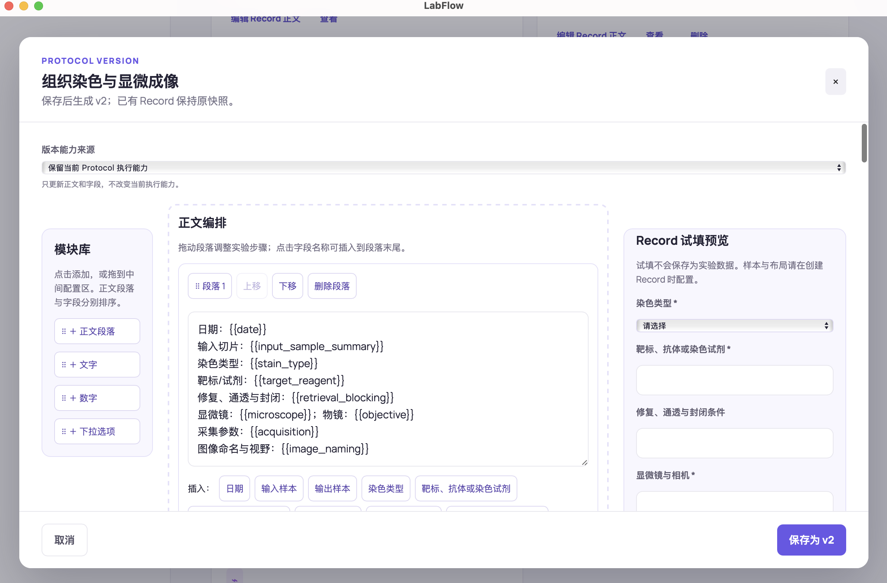
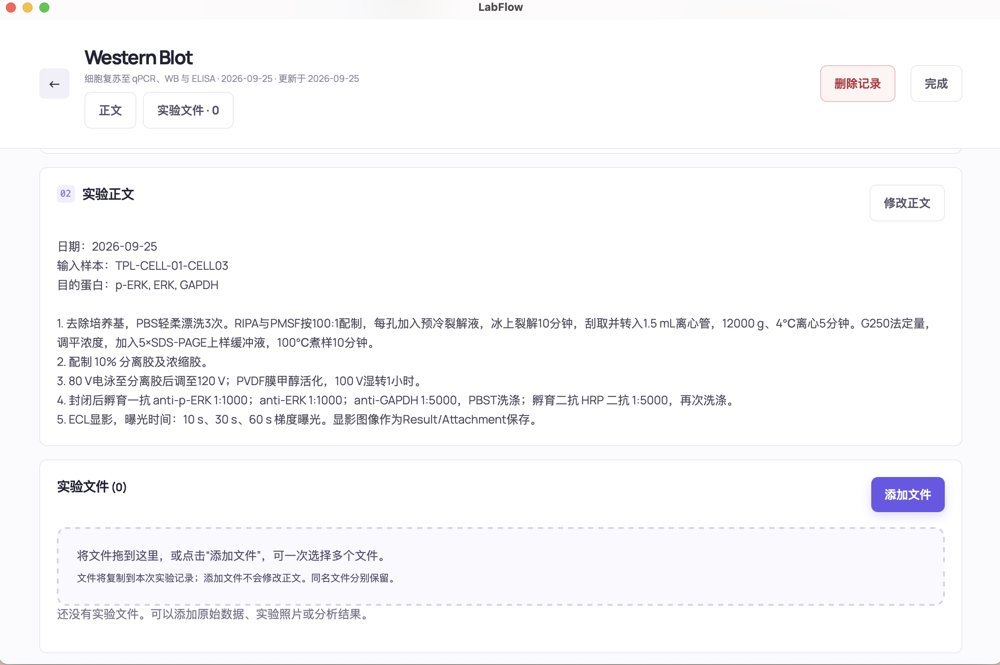
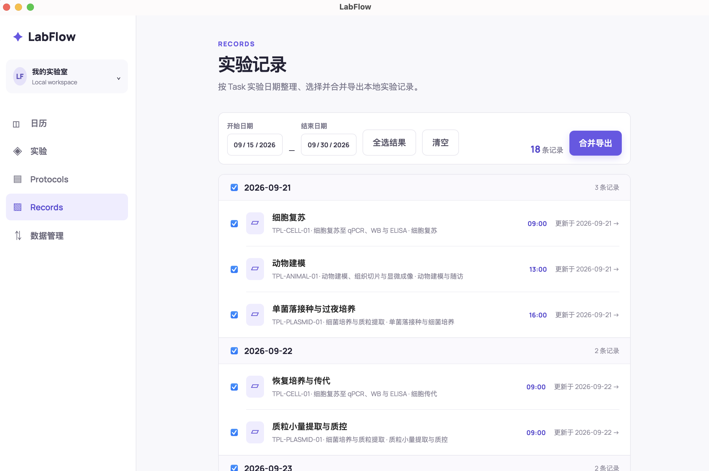

# LabFlow ELN for Biomedical Wet Labs

<p align="center">
  
</p>

<p align="center">
  <strong>Plan experiments, reuse protocols, preserve what actually happened, and keep samples and files connected.</strong><br />
  A private, local-first electronic lab notebook and experiment manager for biomedical wet-lab work.
</p>

<p align="center">
  <a href="README.md">English</a> · <a href="README.zh-CN.md">简体中文</a>
</p>

<p align="center">
  <a href="https://github.com/echoechofu/labflow-releases#下载最新版">Download LabFlow</a>
  ·
  <a href="docs/product/user-guide.md">User guide</a>
  ·
  <a href="docs/architecture/overview.md">Architecture</a>
</p>

LabFlow connects the parts of an experiment that are often split across a calendar, Word documents, spreadsheets, and folders:

```text
Scheduled Task → Versioned Protocol → Actual Record → Samples, images, and original files
```

It is designed for researchers, students, and small biomedical teams who want a lightweight electronic laboratory notebook (ELN) without setting up a cloud account or a laboratory-wide LIMS.

## What makes LabFlow useful

### Plan and record in one workflow

Schedule wet-lab Tasks in a weekly calendar, organize them under an Experiment, and connect dependent steps. A Task leads into its execution Record, so the plan and the evidence of what happened stay together.

### Reuse a method without rewriting history

Create built-in or custom Protocols and reuse them across experiments. LabFlow freezes a version snapshot when a Record is created. Later Protocol edits do not change historical Records, while each run can preserve its actual parameters, deviations, observations, inputs, and outputs.

### Keep experiment data connected

Record sample inputs, generated outputs, consumption, derivation, treatment groups, containers, and plate positions. Insert experimental images into the Record body and attach original files of any type. The SQLite database and attachment files remain in the same local workspace and can be exported as a complete backup.

LabFlow starts with practical biomedical Protocols, so a researcher can begin with a real experiment instead of configuring an entire lab system first.

## Product tour

<table>
  <tr>
    <td colspan="2"><a href="docs/assets/screenshots/weekly-calendar.png"></a></td>
  </tr>
  <tr>
    <td colspan="2" align="center"><strong>Weekly planning</strong><br />Keep several multi-day wet-lab workflows visible in one calendar.</td>
  </tr>
  <tr>
    <td width="50%"><a href="docs/assets/screenshots/task-editor.png"></a></td>
    <td width="50%"><a href="docs/assets/screenshots/protocol-version-editor.png"></a></td>
  </tr>
  <tr>
    <td align="center"><strong>Task setup</strong><br />Assign an Experiment, schedule the work, and connect dependencies.</td>
    <td align="center"><strong>Versioned Protocols</strong><br />Update a method while existing Records keep their original snapshots.</td>
  </tr>
  <tr>
    <td width="50%"><a href="docs/assets/screenshots/record-files.png"></a></td>
    <td width="50%"><a href="docs/assets/screenshots/records-list.png"></a></td>
  </tr>
  <tr>
    <td align="center"><strong>Record files</strong><br />Keep the procedure and original experimental files in the same Record.</td>
    <td align="center"><strong>Review and export</strong><br />Browse Records by experiment date and export selected work together.</td>
  </tr>
</table>

## Core workflows

| Workflow | What LabFlow supports |
| --- | --- |
| Experiment scheduling | Create, edit, relate, and complete Tasks in a 24-hour weekly calendar |
| Experiment context | Group Tasks under an Experiment, inspect their dependency graph, and hide inactive Experiments from planning views |
| Protocol management | Use built-in methods or create custom Protocols with version history and Record snapshots |
| Experimental Records | Capture the procedure actually performed, deviations, observations, images, and arbitrary file attachments |
| Sample tracking | Register inputs, outputs, consumption, derivation, conditions, containers, and plate positions |
| Terminal assays | Store Plate Mapping and Raw Data structures for qPCR, ELISA, and CCK-8 |
| Export and backup | Print Records, create low-memory PDFs, export PDFs with original attachments, and back up the complete workspace |

## Built-in biomedical Protocols

The current catalog includes:

- Cell thawing, passaging, plating, and treatment
- RNA extraction and reverse transcription
- SYBR Green qPCR
- Western blot
- Culture-supernatant collection
- ELISA and CCK-8

Custom Protocols can describe passthrough samples, one-to-one, one-to-many, and one-to-zero transformations. Each Record captures the concrete outputs and sample lineage produced during that run.

## Local-first data ownership

The packaged desktop app does not require an Express server, localhost HTTP API, cloud account, or always-on internet connection. Canonical user data is stored outside the application bundle and source tree:

```text
macOS:   ~/Library/Application Support/LabFlow/
Windows: %APPDATA%\LabFlow\
```

The workspace contains `labflow.sqlite` and `files/`. Original attachments remain in `files/`; SQLite stores their metadata and relative paths. Use **Data Management** inside LabFlow to export or restore a complete `.labflow-backup` workspace.

## Download and platform status

- [macOS 0.1.7 for Apple Silicon](https://github.com/echoechofu/labflow-releases/releases/tag/v0.1.7) — macOS 12 or later. This release introduces signed update manifests, startup update checks, user-confirmed download, and install-and-restart.
- [Windows 0.1.5 for x64](https://github.com/echoechofu/labflow-releases/releases/tag/v0.1.5) — Windows 10/11. Windows was not updated in the 0.1.7 release and does not yet include in-app updates.
- [Public installation guide](https://github.com/echoechofu/labflow-releases#readme)
- [Release changelog](https://github.com/echoechofu/labflow-releases/blob/main/CHANGELOG.md)

The current MVP uses ad-hoc signing on macOS and is not notarized with Apple Developer ID. Windows packages are not Authenticode-signed. Follow the public installation guide if Gatekeeper or SmartScreen asks for confirmation. Updater signatures verify the origin and integrity of update artifacts; they do not replace operating-system code signing.

## Optional MCP integration

LabFlow also exposes part of its Task, Experiment, Protocol, and Record capabilities to local AI clients through a bundled Model Context Protocol (MCP) server. The desktop UI and MCP adapter call the same domain services and validation rules; an Agent does not receive direct SQLite access.

This integration is optional. LabFlow remains a complete local desktop workflow without an Agent. See the [MCP user guide](docs/product/mcp-user-guide.md) and [architecture overview](docs/architecture/overview.md) for details.

## Development

Requirements: Node.js 24, Rust 1.98, and Xcode Command Line Tools on macOS. Windows installers are built on a native GitHub Actions Windows runner.

```bash
cd eln-app
npm install
npm run tauri:dev
```

Project checks:

```bash
cd eln-app
npm run lint
npm test
npm run build:web
cargo test --manifest-path src-tauri/Cargo.toml
```

See [eln-app/README.md](eln-app/README.md) for packaging and data-isolation details.

## Documentation

- [Product scope](docs/product/scope.md)
- [User guide](docs/product/user-guide.md)
- [Core objects, Records, and Sample Flow](docs/product/core-objects-and-sample-flow-guide.md)
- [Protocol domain](docs/domain/protocol.md)
- [Sample lineage](docs/domain/sample-lineage.md)
- [Architecture overview](docs/architecture/overview.md)
- [Database schema](docs/architecture/database.md)
- [Architecture decisions](docs/decisions/)

## Project status

LabFlow is an MVP for individual researchers and small biomedical wet-lab teams. The current interface is primarily Chinese. It does not currently provide cloud sync, real-time multi-user collaboration, automatic conversion of arbitrary Word/PDF files into executable Protocols, or automated scientific conclusions from experimental data.

## License

LabFlow is distributed under the [PolyForm Noncommercial License 1.0.0](LICENSE). Personal use, education, academic research, and other noncommercial uses are permitted. Commercial use requires separate authorization.
